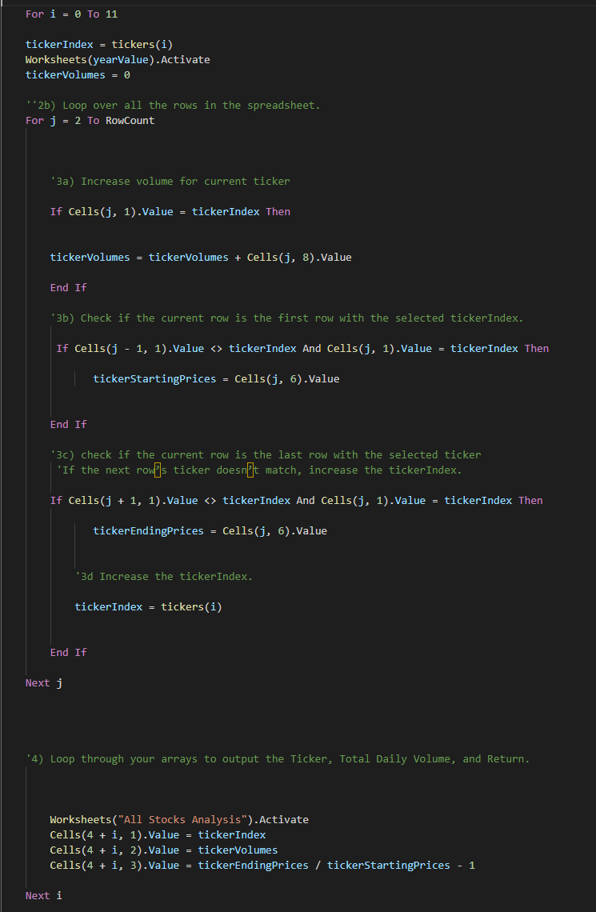
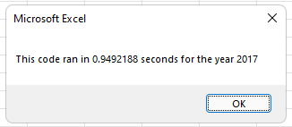
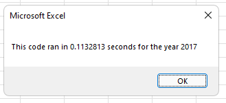

# stock-analysis
## An analysis of stocks for Steve

### Overview

This project involved taking a .xlsx file, and converting it into a .xlxm to work with VBA and add dynamic script to Steve's stock analysis.
At first, Steve wanted us to only look at the values of DQ in 2017 and 2018. After he saw the success of the script we wrote for him, he requested a similar script that could quickly analyse several stocks on the market.
For later use to look at an even larger set of stocks, Steve asked us to retool the script to run more efficiently.

## Results

- As Previously stated, Steve wanted us to initailly look at the value of DQ in 2017 and 2018. After creating the script to analyse DQ, the script found DQ had a decent amount of volume, but a yearly return yield of -63%, which clearly indicated that Steve should not invest in DQ.
- We expanded the paramaters of the script to look at several stocks by nesting for loops to check the conditions of starting price, ending price, and ticker index number.

As seen in this picture:

- The code was refactored and ran 0.1484375 seconds faster for 2017 and 0.140625 seconds faster for 2018.

## Challenges

- I had issues nesting the j loop into the i loop, and increasing the tickerIndex count within the two loops.

- I also had a divide by zero error because I mislabeled "tickerStartingPrice" in the j loop to just "StartingPrice"

- I commented out most of the code to work line by line to find my issues and added the rest of the code back in slowly to make sure everything still worked.

# Conclusion

- Refactoring code is useful for programmers because it helps improve maintenance activities, streamlines code, and can improve speed as seen in the two comparison pictures for 2017 here:

- The larger the project or team, there can be more room for refactoring to cause more issues than it solves, taking time away from developing new features for a script, or even forcing a team to revert to a previous version of the code.

- Refactoring this script was fairly straightforwad, as it had few improvements made on the original. The script now runs faster, but it took several hours to debug due to the issues I had with mislabeling variables.