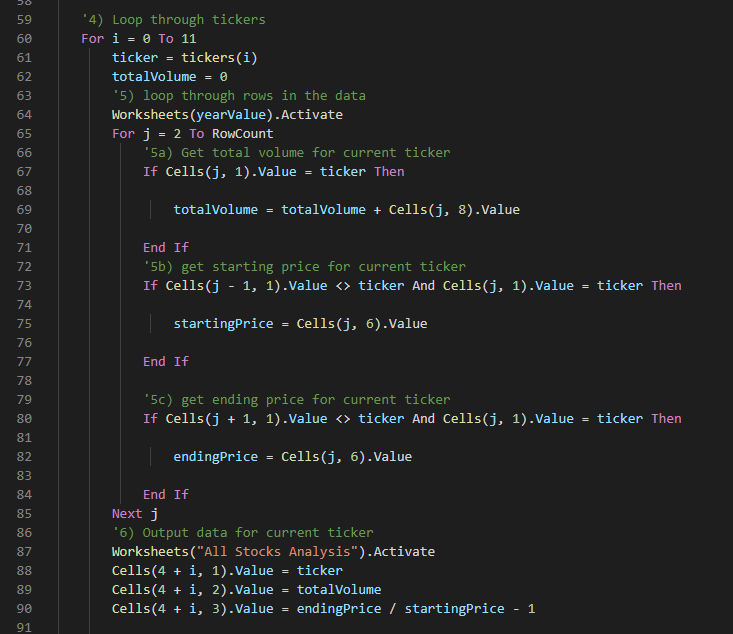

# stock-analysis
## An analysis of stocks for Steve

### Overview

This project involved taking a .xlsx file, and converting it into a .xlxm to work with VBA and add dynamic script to Steve's stock analysis.
At first, Steve wanted us to only look at the values of DQ in 2017 and 2018. After he saw the success of the script we wrote for him, he requested a similar script that could quickly analyse several stocks on the market.
For later use to look at an even larger set of stocks, Steve asked us to retool the script to run more efficiently.

## Results

- As Previously stated, Steve wanted us to initailly look at the value of DQ in 2017 and 2018. After creating the script to analyse DQ, the script found DQ had a decent amount of volume, but a yearly return yield of -63%, which clearly indicated that Steve should not invest in DQ.
- We expanded the paramaters of the script to look at several stocks by nesting for loops to check the conditions of starting price, ending price, and ticker index number.

As seen in this picture:

- The loop and subsequent if statments were further improved upon to speed up the script over 80%.

As seen here:

- the execution of the script is now much faster, and Steve can use this script to analyze even more stocks if he would like.

### 2017 vs 2018 Stock Performances

While 2017 saw positive growth for the portfolio, 2018 had a different story to tell.  Only ENPH and RUN produced a positive ROI bewteen the two years, and the other ten options saw a negative return.

]

]

The portfolio did see a decrease overall, but many factors, such as econmic and industry related influxes, impact the growth or decline of a portfolio. Steve should look into these influences before advising his parents on which direction to move with their investments.

### Execution

- I was able to improve the runtime of the script by over 80%.

## Challenges

- I had issues nesting the i loop into the tickerIndex loop, and increasing the tickerIndex count within the two loops.

- I also had a divide by zero error because I mislabeled "tickerStartingPrice" in the i loop to just "StartingPrice"

- I commented out most of the code to work line by line to find my issues and added the rest of the code back in slowly to make sure everything still worked.

# Conclusion

- Refactoring code is useful for programmers because it helps improve maintenance activities, streamlines code, and can improve speed as seen previously stated.

- The larger the project or team, there can be more room for refactoring to cause more issues than it solves, taking time away from developing new features for a script, or even forcing a team to revert to a previous version of the code.

- Refactoring this script added new variables to our For loops and if statemenets, which creates room for errors such as missing a refrence or calling for the wrong variable on the wrong line.

- There was a marked improvement in runtime, as the script now runs faster over 80% faster. 

- It can easily breakdown larger datasets faster than the original code, but it took several hours, and many sessions revisiting problems to debug due to the issues I had with mislabeling variables.